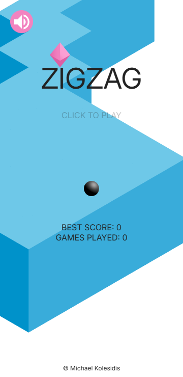

# ZigZag

A 3D ZigZag game built with React Three Fiber.

Stay on the wall and zigzag as far as you can!
Just tap the screen to change the ball’s direction.  
One wrong move and you’re off the edge!
How far can you make it?

## 🛠️ Technologies Used

- React
- Three.js
- React Three Fiber
- Drei
- Zustand

## 🎮 Overview

ZigZag is an endless runner where the player controls a ball moving along a narrow zigzagging path suspended in the air. The core challenge is to keep the ball from falling off the edges by tapping the screen to change its direction at the right moment.

## 🧩 Core Gameplay Mechanics

| **Feature**                      | **Description**                                                                            |
| -------------------------------- | ------------------------------------------------------------------------------------------ |
| **One-Tap Control**              | Tap the screen (or click) to change the ball’s direction by 90°. No other inputs are used. |
| **Zigzag Path**                  | The path is made of square tiles in alternating zigzag directions.                         |
| **Endless Generation**           | The path is procedurally generated and continues indefinitely.                             |
| **Falling Off**                  | The ball falls off the edge if you mistime a turn — this ends the game.                    |
| **Camera Follow**                | The camera smoothly follows the ball from a top-down, slightly angled view.                |
| **Score System**                 | Earn 1 point for each tile successfully crossed.                                           |
| **Gem Collection**               | Gems appear on random tiles; collecting them adds 1 point to your score.                   |
| **+1 Floating Text**             | A “+1” text briefly appears and fades out at the gem’s position when collected.            |
| **Speed Scaling**                | The ball’s speed gradually increases, raising difficulty as you progress.                  |
| **High Score**                   | The game saves and displays your best score.                                               |
| **Minimal UI**                   | Clean interface showing score, best score, and audio toggle.                               |
| **No Pause**                     | Once gameplay starts, it cannot be paused.                                                 |
| **Optional Sound**               | Subtle sound effects for turning, collecting gems, and UI interactions.                    |
| **No Tutorials**                 | The game starts instantly with no instructions — easy to learn by playing.                 |
| **Playable on Mobile & Desktop** | Optimized for both touchscreens and mouse clicks — works on all devices.                   |

<!-- ## 📸 Screenshots -->

## 📜 License

Copyright (c) Michael Kolesidis  
Licensed under the [GNU Affero General Public License v3.0](https://www.gnu.org/licenses/agpl-3.0.html).
