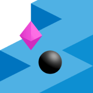

# ZigZag

A 3D _ZigZag_ game built with React Three Fiber.

Stay on the wall and zigzag as far as you can!  
Just tap the screen to change the ball’s direction.  
One wrong move and you’re off the edge!  
How far can you make it?  

**Play Online:**

[zigzag.michaelkolesidis.com](https://zigzag.michaelkolesidis.com/)  

This software is free (as in freedom). **If you use any part of this code, your project's source code must also be made publicly available under the same license.** This applies whether you modify the code or use it as it is in your own project. This ensures that all modifications and derivative works remain free software, so that everyone can benefit. If you are not willing to comply with these terms, you must refrain from using any part of this code.

For full license terms and conditions, you can read the AGPL-3.0 at: [gnu.org/licenses/agpl-3.0.html](https://www.gnu.org/licenses/agpl-3.0.html).

## 🛠️ Technologies

The core technologies of _ZigZag_ are Three.js and React. The following libraries and tools are used:

| Name              | License | Description                                            |
| ----------------- | :-----: | ------------------------------------------------------ |
| React             |   MIT   | A component-based library for building user interfaces |
| Three.js          |   MIT   | 3D graphics API for the web, based on WebGL            |
| React Three Fiber |   MIT   | A React renderer for Three.js                          |
| Drei              |   MIT   | Useful helpers for React Three Fiber                   |
| Zustand           |   MIT   | State management                                       |
| R3F-Perf          |   MIT   | Performance monitoring                                 |
| Vite              |   MIT   | Frontend development tooling                           |

## 🎮 Overview

_ZigZag_ is a minimalist, abstract endless runner where the player controls a black ball ⚫ rolling along a narrow, zigzagging ↖️↗️ path suspended in midair. With each tap, the ball changes direction by 90°, and the goal is to stay on the path for as long as possible. The challenge lies in tapping the screen at the right moment to prevent the ball from falling off the edges. This simple, one-touch mechanic creates a high-stakes test of timing and precision, as a single misstep sends the ball tumbling off the path, ending the run.

The path is endlessly and procedurally generated, forming a jagged zigzag route that demands increasing focus and reflexes as the speed subtly ramps up. Along the way, players can collect purple gems that spawn randomly on tiles, adding an optional layer of reward.

Visually, the game is stripped to its core elements: clean geometric shapes, soft pastel hues, and no clutter — just motion and form. The world feels abstract and ambient, keeping full focus on the gameplay. There are no tutorials, no pause, and no distractions — just the ball, the path, and your reactions.

## 🧩 Core Gameplay Mechanics & Features

| **Feature**                      | **Description**                                                                                        |
| -------------------------------- | ------------------------------------------------------------------------------------------------------ |
| **One-Tap Control**              | Tap the screen (or click) to change the ball’s direction by 90°. No other inputs are used.             |
| **Falling Off**                  | The ball falls off the edge if you mistime a turn — this ends the game.                                |
| **Zigzag Path**                  | The path is made of square tiles in alternating zigzag directions.                                     |
| **Endless Generation**           | The path is procedurally generated and continues indefinitely.                                         |
| **Tile Falling**                 | Tiles begin to fall after the ball passes them, adding a sense of urgency and dynamism.                |
| **Camera Follow**                | The camera smoothly follows the ball from a top-down, slightly angled view.                            |
| **Score System**                 | Earn 1 point for each tile successfully crossed.                                                       |
| **Gem Collection**               | Gems appear on random tiles; collecting them adds 1 point to your score.                               |
| **Floating Text on Collection**  | A “+1” text briefly appears and fades out at the gem’s position when collected.                        |
| **Speed Scaling**                | The ball’s speed gradually increases, raising difficulty as you progress, up to a maximum speed limit. |
| **High Score**                   | The game saves and displays your best score.                                                           |
| **Minimal UI**                   | Clean interface (intro and game over screens) showing current score, high score, and audio toggle.     |
| **UI Slide Animations**          | Intro and game over screen elements smoothly slide into view with animated transitions.                |
| **No Pause**                     | Once gameplay starts, it cannot be paused.                                                             |
| **Optional Sound**               | Subtle sound effects for turning, collecting gems, and UI interactions.                                |
| **No Tutorials**                 | The game starts instantly with no instructions — easy to learn by playing.                             |
| **Playable on Mobile & Desktop** | Optimized for both touchscreens and mouse clicks — works on all devices.                               |
| **Performance Monitor**          | Press P to toggle a Three.js performance monitor or add #debug after the URL to keep it on.            |
| **Installable PWA**              | Fully installable as a Progressive Web App for mobile and desktop.                                     |
| **Offline Play**                 | Once installed, the game is fully playable offline via local caching.                                  |
| **Keyboard Support**             | Game can be played using the keyboard, Enter/Arrow Up/Arrow Down to turn, Space to reset.              |
| **Dark Mode**                    | Darker theme with adjusted colors for low-light play.                                                  |
<!-- | **Cheating Prevention**          | Limit the rate of user inputs to prevent autoclicker abuse.                                            | -->
| **Debug Mode**                   | Add _#debug_ to the URL to disable falling and show performance stats.                                 |

## 📸 Screenshots

## 🤝 Contributing

Contributions to _ZigZag_ are always welcome and greatly appreciated! Whether you're fixing bugs, adding new features, improving the codebase, or enhancing the documentation, there's always room for improvement. Fork the repository, make your changes, and create a pull request.

_ZigZag_ is in active development, so if you have ideas or want to help, feel free to follow these steps:

1. We recommend starting by creating an issue to discuss any proposed changes.
2. Fork the project.
3. Create your feature branch: `git checkout -b feature/AmazingFeature`
4. Commit your changes: `git commit -m 'Add some AmazingFeature'`
5. Push to your branch: `git push origin feature/AmazingFeature`
6. Open a pull request to the `develop` branch.

### Submitting Pull Requests

If you've fixed a bug or added a new feature, we encourage you to submit a pull request (PR). When submitting your PR:

- Provide a clear title and description explaining the changes you’ve made.
- Ensure your code adheres to the project's coding standards and conventions.
- Test your changes on all supported platforms (e.g., Windows, macOS, Android, iOS).
- If your PR fixes an issue, include the issue number in the PR description (e.g., "Fixes #123").

We review pull requests regularly and will merge them as soon as possible after ensuring the changes align with the project's goals.

### Reporting Issues

If you encounter any bugs, glitches, or have suggestions for new features, we encourage you to open an issue on the GitHub repository. When submitting an issue, please include as much detail as possible to help us address it quickly. This might include:

- A clear description of the problem or feature request.
- Steps to reproduce the issue, if applicable.
- Screenshots or screen recordings to illustrate the issue.
- Any relevant error messages or logs.

### Code of Conduct

We believe in fostering a respectful, open, and collaborative community. Please engage with others in a positive and helpful manner, as we're all here to improve the project together. Thus, we ask that all contributors adhere to our [Contributor Covenant Code of Conduct](./CODE_OF_CONDUCT.md) that promotes respect, inclusivity, and collaboration. Let's keep _ZigZag_ a positive space for everyone!

By contributing to _ZigZag_, you help improve the project, and we appreciate your time and effort!

## 💻 Software Used

The following software tools were utilized in the development of _ZigZag_:

- Visual Studio Code
- Google Chrome
- Inkscape
- Audacity

## 🧪 Testing

_ZigZag_ has been tested across a wide range of platforms, browsers, and devices to ensure optimal performance and compatibility. The goal was to make the game accessible and run smoothly on virtually any device. Notably, it performs well even on older models, such as the 2018 Honor 8X (Android 10, Kirin 710, Mali-G51 MP4, 4GB RAM).

### Tested Browsers

- Google Chrome
- Vivaldi
- Chromium
- Mozilla Firefox
- GNOME Web
- Microsoft Edge
- Safari

### Tested Platforms

- Windows
- macOS
- Linux (Ubuntu)
- Android
- iOS

## 📜 License

Copyright (c) Michael Kolesidis  
Licensed under the [GNU Affero General Public License v3.0](https://www.gnu.org/licenses/agpl-3.0.html).
